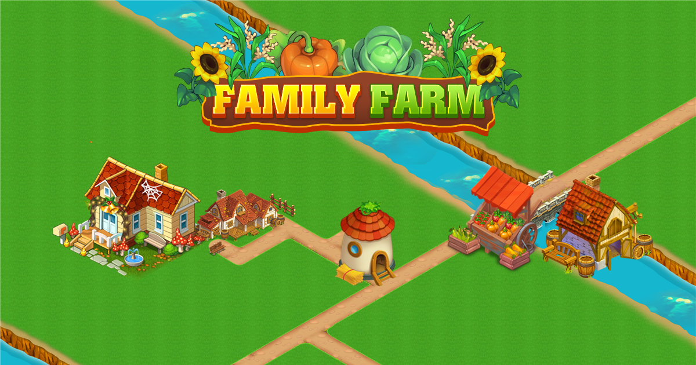
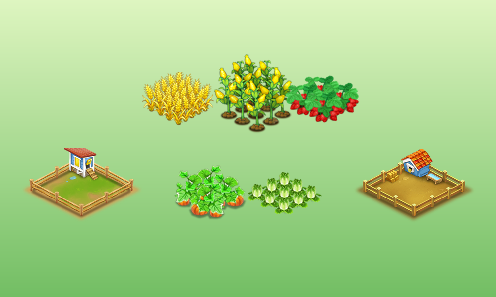
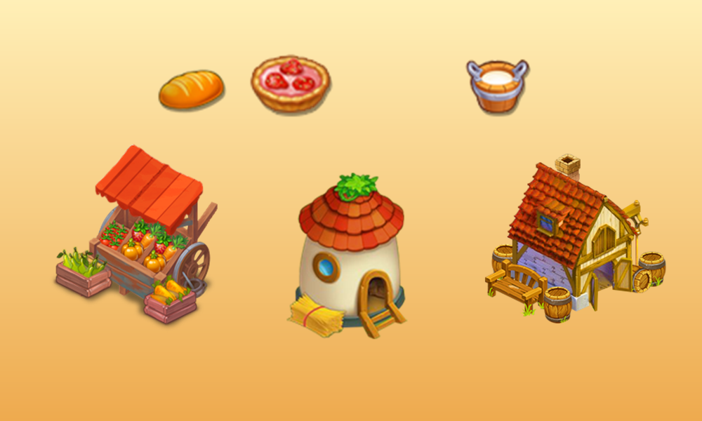

# Farm Town

Farm Town is a 2D Unity farming game. Players grow crops, raise animals, operate production buildings, complete orders, expand land, decorate the farm, and earn progression rewards.

<p align="center">
  
</p>

## Gameplay Showcase

<table>
  <tr>
    <td width="50%"></td>
    <td width="50%"></td>
  </tr>
  <tr>
    <td align="center"><strong>Grow crops and raise animals</strong></td>
    <td align="center"><strong>Produce goods and grow the farm economy</strong></td>
  </tr>
</table>

## Features

- Crop planting, growth, harvesting, and plot expansion.
- Animal feeding and product collection.
- Production buildings with ingredient checks and queued output.
- Crop and product inventory, selling, orders, and delivery rewards.
- Building, decoration, placement, and movement systems.
- Player level, experience, coins, diamonds, audio, tutorials, and daily rewards.
- App Open, interstitial, and rewarded mobile ads.
- Bundled mini-game content under `Assets/Mini_Game`.

## Requirements

- Unity Hub.
- Unity Editor `6000.3.10f1`.
- Android Build Support, SDK, NDK, and JDK for Android builds.

Use matching Unity version to avoid unintended asset or serialization upgrades.

## Project Structure

```text
Share006_FarmTown/
|-- FarmTown/
|   |-- Assets/
|   |   |-- Art/                 # Animations, audio, effects, particles, sprites
|   |   |-- Data/                # ScriptableObject data and data tooling
|   |   |-- Editor/Migration/    # English migration inventory and validators
|   |   |-- Prefabs/             # Gameplay and UI prefabs by domain
|   |   |-- Scenes/              # Home and main farm scenes
|   |   |-- Scripts/             # Gameplay code grouped by domain
|   |   |-- Tests/EditMode/      # Unity EditMode migration tests
|   |   |-- Mini_Game/           # Excluded bundled mini-game content
|   |   `-- Plugins/             # Third-party runtime plugins
|   |-- Docs/Migration/          # Migration evidence and reports
|   |-- Packages/                # Unity Package Manager manifest
|   `-- ProjectSettings/         # Unity and build configuration
|-- LICENSE
`-- README.md
```

## Open and Run

1. Clone repository.
2. In Unity Hub, select **Add project from disk**.
3. Select `FarmTown` directory.
4. Wait for asset import and package resolution.
5. Open `Assets/Scenes/Home.unity`.
6. Enter Play Mode.

If DOTween requests setup, open **Tools > Demigiant > DOTween Utility Panel** and run **Setup DOTween**.

## Build Scenes

| Index | Scene | Purpose |
| ---: | --- | --- |
| `0` | `Assets/Scenes/Home.unity` | Startup and loading flow |
| `1` | `Assets/Scenes/map.unity` | Main farm gameplay |
| `2` | `Assets/Mini_Game/Minigame/Scenes/3_Mini_Game.unity` | Mini-game flow |

Keep scene order stable unless every numeric scene transition is updated and tested.

## Save Compatibility

English naming does not intentionally reset existing progress.

- Renamed serialized fields retain `FormerlySerializedAs` aliases where required.
- Unity assets keep original `.meta` files and GUIDs during moves.
- `Assets/Scripts/Save/LegacySaveKeys.cs` preserves historical PlayerPrefs keys.
- `SaveMigrationService` copies supported legacy values into stable English save keys.
- Stable instance IDs prevent renamed scene objects from changing persistence identity.

Do not rename legacy PlayerPrefs keys or remove serialization aliases without a separate save migration.

## Validation

Run commands from repository root in PowerShell.

### Migration Validator

```powershell
& 'C:\Program Files\Unity\Hub\Editor\6000.3.10f1\Editor\Unity.exe' `
  -batchmode -nographics -quit `
  -projectPath (Resolve-Path FarmTown) `
  -executeMethod FarmTown.Editor.Migration.ProjectMigrationCli.Validate `
  -logFile migration-validation.log
```

Required counters:

```text
MissingScript=0
MissingReference=0
UnexpectedGuidChange=0
NeedsMapping=0
NonEnglishFirstPartyPath=0
NonEnglishFirstPartySymbol=0
ForbiddenStringLookup=0
```

### Unity EditMode Tests

```powershell
$unity = 'C:\Program Files\Unity\Hub\Editor\6000.3.10f1\Editor\Unity.exe'
$project = (Resolve-Path FarmTown).Path

$process = Start-Process $unity -ArgumentList @(
  '-batchmode',
  '-nographics',
  '-projectPath', $project,
  '-runTests',
  '-testPlatform', 'editmode',
  '-testResults', (Join-Path (Get-Location) 'unity-editmode-results.xml'),
  '-logFile', (Join-Path (Get-Location) 'unity-editmode.log')
) -Wait -PassThru -WindowStyle Hidden

exit $process.ExitCode
```

Do not add `-quit` to this test command. Unity Test Runner exits after writing results; `-quit` can terminate before test execution completes.

### C# Builds

```powershell
dotnet build FarmTown/FarmTown.Save.csproj --no-restore
dotnet build FarmTown/FarmTown.EditModeTests.csproj --no-restore
git diff --check
```

## Migration Boundaries

First-party gameplay code, assets, prefabs, scene objects, and data use English names. Migration intentionally excludes third-party code and bundled mini-game content:

- `Assets/Mini_Game/**`
- `Assets/GoogleMobileAds/**`
- `Assets/MobileDependencyResolver/**`
- `Assets/Parse/**`
- `Assets/Plugins/**`
- `Assets/Spine/**`

Avoid editing vendor code solely for naming consistency. See `FarmTown/Docs/Migration/final-report.md` and `rename-inventory.csv` for migration evidence.

## License

See `LICENSE`.
